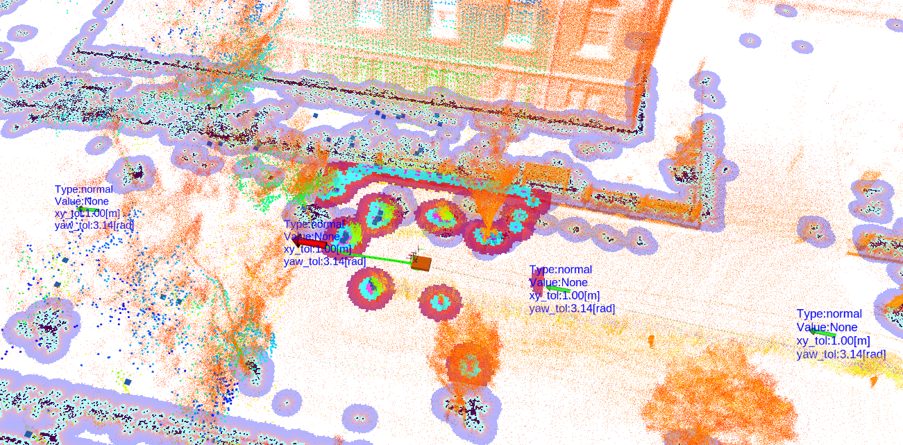
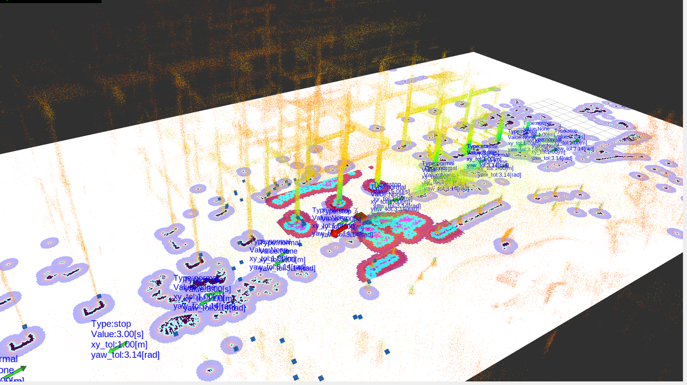
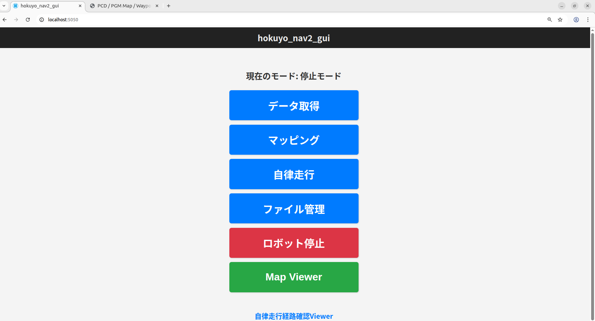
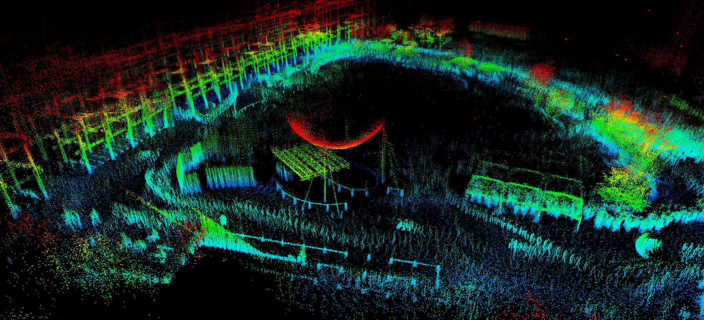
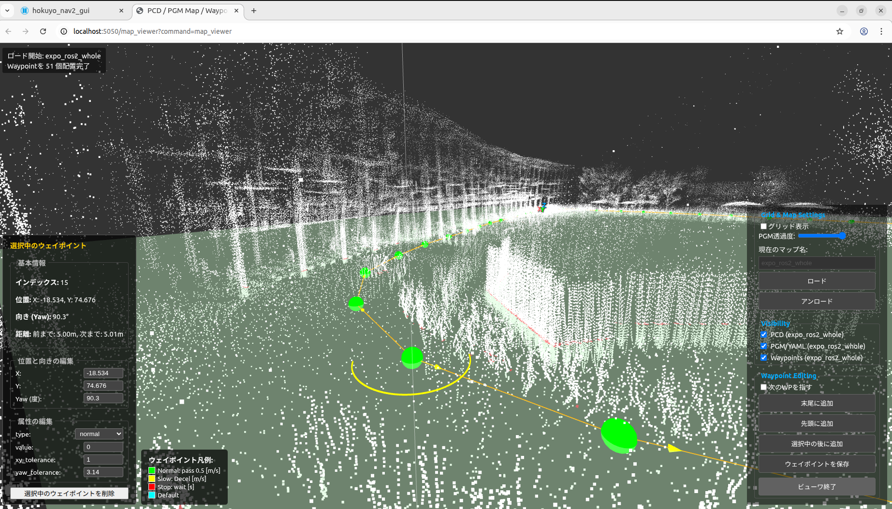

# hokuyo_navigation2

`hokuyo_navigation2` は、北陽電機製の 3D LiDAR・RTK-GNSS一体型センサ RSF 専用の ROS2 ベースの屋内外対応ナビゲーションシステムのパッケージ群です。3D-SLAM, 自己位置推定、ROS 2 Navigation Stack (Nav2) を連携させ、高精度な自律移動を実現します。また、直感的な操作を可能にするWebベースのGUIを用いることで、マッピングからナビゲーションまでの一連の操作をブラウザから簡単に行うことができます。











## 主な機能

- **ロボットとセンサノードの起動**
  - モータドライバ・センサのROS2ノードの起動
- **3D SLAMと2Dウェイポイントファイル出力の同時実行**:
  - `hokuyo_lio` を用いた高精度なLiDAR慣性オドメトリ（LIO）と3D点群マップ生成。
  - ROS Bagから`lio_raw`（軌跡ベース）または`p2o`（点群ベース）の3Dマップ（`.pcd`）を作成。
  - 3D点群マップ生成と同時にウェイポイント作成
  - 3D点群マップをNav2用の2Dグリッドマップ（`.pgm`, `.yaml`）へ変換。

- **ナビゲーション [`hokuyo_navigation2`](https://github.com/hokuyo-rd/hokuyo_navigation2)**:
  - `hokuyo_rsf`を利用したリアルタイム3D自己位置推定を用いた自律走行
  - 3D点群マップと`simple_fastlio_localization` を利用したリアルタイム自己位置推定を用いた自律走行
  - Nav2 (Navigation2) スタックと連携し、指定されたウェイポイントに沿った自律走行。
  - 単一マップ走行および複数マップを連続して走行するマルチマップナビゲーションに対応。

- **ブラウザベースの統合GUI [`hokuyo_navigation2_gui`](https://github.com/hokuyo-rd/hokuyo_navigation2_gui)**:
  - **プロセス実行**: データ取得、マッピング、ナビゲーションの各プロセスをブラウザから起動。
  - **ファイル管理**: マップ、ウェイポイント、設定ファイルなどをブラウザ上で管理（作成、名前変更、削除）。
  - **高機能エディタ**:
    - **Map Viewer**: 3D/2Dマップとウェイポイントを視覚化し、GUI上で直感的にウェイポイントを編集（追加、移動、回転、属性変更）。
    - **CSV Editor**: マルチマップ走行シナリオをテーブル形式で簡単に編集。


## セットアップ

```bash
sudo apt-get update 
# 1. build ros2 packages
cd <YOUR_ROS2_WORKSPACE>/src
git clone --recursive https://github.com/hokuyo-rd/hokuyo_nav2_pkgs.git hokuyo_navigation2
rosdep update
rosdep install --from-paths src/hokuyo_navigation2 --ignore-src -r -y

# 2. Python パッケージ
cd <YOUR_ROS2_WORKSPACE>/src/hokuyo_navigation2
pip3 install -r requirements.txt

cd ../../../

# 3. hokuyo_slam_ros2 build
sudo apt-get install libsqlite3-dev sqlite3 libeigen3-dev qtbase5-dev clang qtcreator libqt5x11extras5-dev

mkdir hokuyo_lib
cd hokuyo_lib

## proj
cd hokuyo_lib
wget https://download.osgeo.org/proj/proj-9.4.1.tar.gz
tar -zxvf proj-9.4.1.tar.gz
cd proj-9.4.1
mkdir build
cd build
cmake ..
cmake --build .
sudo cmake --build . --target install

## pcl 1.14.1 ビルドに時間がかかります。
cd hokuyo_lib
wget https://github.com/PointCloudLibrary/pcl/releases/download/pcl-1.14.1/source.tar.gz -O pcl.tar.gz
tar -xvf pcl.tar.gz
cd pcl
cmake -Bbuild -DCMAKE_INSTALL_PREFIX=/opt/pcl .
cmake --build build
sudo cmake --install build
export CMAKE_PREFIX_PATH=$CMAKE_PREFIX_PATH:/opt/pcl

## hokuyo_slam_ros2
cd <YOUR_ROS2_WORKSPACE>/src/hokuyo_navigation2/hokuyo_slam_ros2
export CMAKE_PREFIX_PATH=$CMAKE_PREFIX_PATH:/opt/pcl

mkdir build
cmake -Bbuild . && cmake --build build

# 4. colcon build
colcon build
colcon build --symlink-install --packages-select hokuyo_navigation2 lio_nav2_bringup simple_fastlio_localization

# 5. firewall
sudo ufw allow 5050/tcp
sudo ufw allow 5050
sudo ufw allow 5000/tcp
sudo ufw allow 5000
sudo ufw allow 5001/tcp
sudo ufw allow 5001
sudo ufw allow 8000/tcp
sudo ufw allow 8000
sudo ufw allow 9000/tcp
sudo ufw allow 9000
sudo ufw allow 9090/tcp
sudo ufw allow 9090
sudo ufw enable
```

## 実行方法

サーバーの起動

```bash
cd <YOUR_ROS2_WORKSPACE>/src/hokuyo_navigation2/hokuyo_navigation2
./scripts/00_sample_util/start_server.bash
```

Webブラウザで `http://<ホストマシンのIPアドレス>:5050` にアクセスします。GUIの指示に従い、マッピングやナビゲーションを実行してください。詳細は [`hokuyo_navigation2_gui`](https://github.com/hokuyo-rd/hokuyo_navigation2_gui) のドキュメントを参照してください。

サーバーなしでの実行

## 停止方法

サーバーの停止

```bash
cd <YOUR_ROS2_WORKSPACE>/src/hokuyo_navigation2/hokuyo_navigation2
./scripts/00_sample_util/stop_server.bash
```